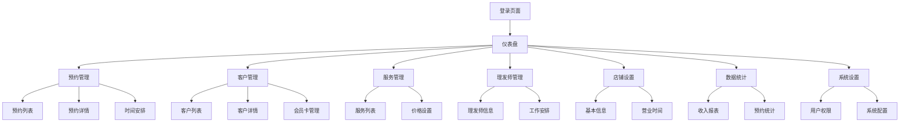

# 男士理发店管理后台产品需求文档

## 1. 产品概述

男士理发店管理后台是一个专为理发店业务设计的管理系统，帮助店主高效管理预约、客户、服务和店铺运营数据。

该系统解决理发店日常运营中的预约管理混乱、客户信息分散、服务定价不统一等问题，为店主提供一站式的数字化管理解决方案。

目标是提升理发店的运营效率，增强客户服务体验，实现数据化经营管理。

## 2. 核心功能

### 2.1 用户角色

| 角色 | 注册方式 | 核心权限 |
|------|----------|----------|
| 超级管理员 | 系统初始化创建 | 拥有所有功能权限，包括系统设置和用户管理 |
| 店长 | 超级管理员邀请 | 管理预约、客户、服务、查看统计数据 |
| 理发师 | 店长邀请 | 查看自己的预约安排，更新服务状态 |

### 2.2 功能模块

我们的理发店管理后台包含以下主要页面：

1. **仪表盘页面**：数据概览、今日预约、收入统计、快捷操作
2. **预约管理页面**：预约列表、预约详情、预约状态管理、时间安排
3. **客户管理页面**：客户列表、客户详情、会员卡管理、消费记录
4. **服务管理页面**：服务项目列表、价格设置、服务分类管理
5. **理发师管理页面**：理发师信息、工作安排、业绩统计
6. **店铺设置页面**：基本信息、营业时间、联系方式设置
7. **数据统计页面**：收入报表、预约统计、客户分析、趋势图表
8. **系统设置页面**：用户权限、系统配置、数据备份

### 2.3 页面详情

| 页面名称 | 模块名称 | 功能描述 |
|----------|----------|----------|
| 仪表盘页面 | 数据概览 | 显示今日预约数、收入、客户数等关键指标 |
| 仪表盘页面 | 今日预约 | 展示当天的预约安排和状态 |
| 仪表盘页面 | 快捷操作 | 提供新增预约、查看客户等快捷入口 |
| 预约管理页面 | 预约列表 | 分页显示所有预约，支持筛选和搜索 |
| 预约管理页面 | 预约详情 | 查看预约的详细信息，包括客户、服务、时间 |
| 预约管理页面 | 状态管理 | 确认、完成、取消预约，发送通知 |
| 预约管理页面 | 时间安排 | 日历视图显示预约时间安排 |
| 客户管理页面 | 客户列表 | 显示所有客户信息，支持搜索和分类 |
| 客户管理页面 | 客户详情 | 查看客户基本信息、消费历史、偏好设置 |
| 客户管理页面 | 会员卡管理 | 充值、扣费、查看余额和使用记录 |
| 服务管理页面 | 服务列表 | 管理所有服务项目，包括名称、价格、时长 |
| 服务管理页面 | 价格设置 | 设置和调整服务价格，支持会员价 |
| 服务管理页面 | 分类管理 | 创建和管理服务分类 |
| 理发师管理页面 | 理发师信息 | 管理理发师基本信息和技能标签 |
| 理发师管理页面 | 工作安排 | 设置理发师的工作时间和休假 |
| 理发师管理页面 | 业绩统计 | 查看理发师的服务次数和收入统计 |
| 店铺设置页面 | 基本信息 | 设置店铺名称、地址、简介等信息 |
| 店铺设置页面 | 营业时间 | 配置每日营业时间和节假日安排 |
| 店铺设置页面 | 联系方式 | 设置电话、微信等联系方式 |
| 数据统计页面 | 收入报表 | 按日、周、月统计收入数据 |
| 数据统计页面 | 预约统计 | 分析预约量、完成率、取消率等指标 |
| 数据统计页面 | 客户分析 | 客户增长、活跃度、消费习惯分析 |
| 数据统计页面 | 趋势图表 | 可视化展示各项数据的变化趋势 |
| 系统设置页面 | 用户权限 | 管理不同角色的权限设置 |
| 系统设置页面 | 系统配置 | 设置系统参数和业务规则 |
| 系统设置页面 | 数据备份 | 数据导出和备份功能 |

## 3. 核心流程

### 管理员流程
1. 登录系统 → 查看仪表盘数据概览 → 处理待确认预约 → 查看客户信息 → 设置服务价格 → 查看统计报表

### 理发师流程
1. 登录系统 → 查看今日预约安排 → 更新服务状态 → 查看个人业绩

### 预约管理流程
1. 客户端提交预约 → 管理后台接收通知 → 管理员确认预约 → 安排理发师 → 服务完成 → 更新状态

## 4. 用户界面设计

### 4.1 设计风格

- **主色调**：深蓝色 (#1890FF) 和白色 (#FFFFFF)
- **辅助色**：灰色 (#F5F5F5)、绿色 (#52C41A)、橙色 (#FA8C16)
- **按钮样式**：圆角矩形，主按钮使用主色调，次要按钮使用边框样式
- **字体**：系统默认字体，标题 16px，正文 14px，辅助文字 12px
- **布局风格**：左侧导航 + 顶部面包屑 + 主内容区域的经典后台布局
- **图标风格**：使用 Ant Design 图标库，简洁现代

### 4.2 页面设计概览

| 页面名称 | 模块名称 | UI元素 |
|----------|----------|--------|
| 仪表盘页面 | 数据概览 | 卡片式布局，数字大屏显示，使用蓝色主题，图表采用柱状图和折线图 |
| 预约管理页面 | 预约列表 | 表格布局，状态标签用不同颜色区分，操作按钮右对齐 |
| 客户管理页面 | 客户列表 | 头像 + 信息卡片布局，搜索框置顶，分页器底部居中 |
| 服务管理页面 | 服务列表 | 网格卡片布局，价格突出显示，编辑按钮悬浮显示 |
| 数据统计页面 | 图表展示 | 响应式图表布局，支持时间筛选，颜色渐变效果 |

### 4.3 响应式设计

系统采用桌面优先的设计策略，主要面向 PC 端使用，同时兼容平板设备。左侧导航在小屏幕下可收缩为图标模式，表格在移动端支持横向滚动。