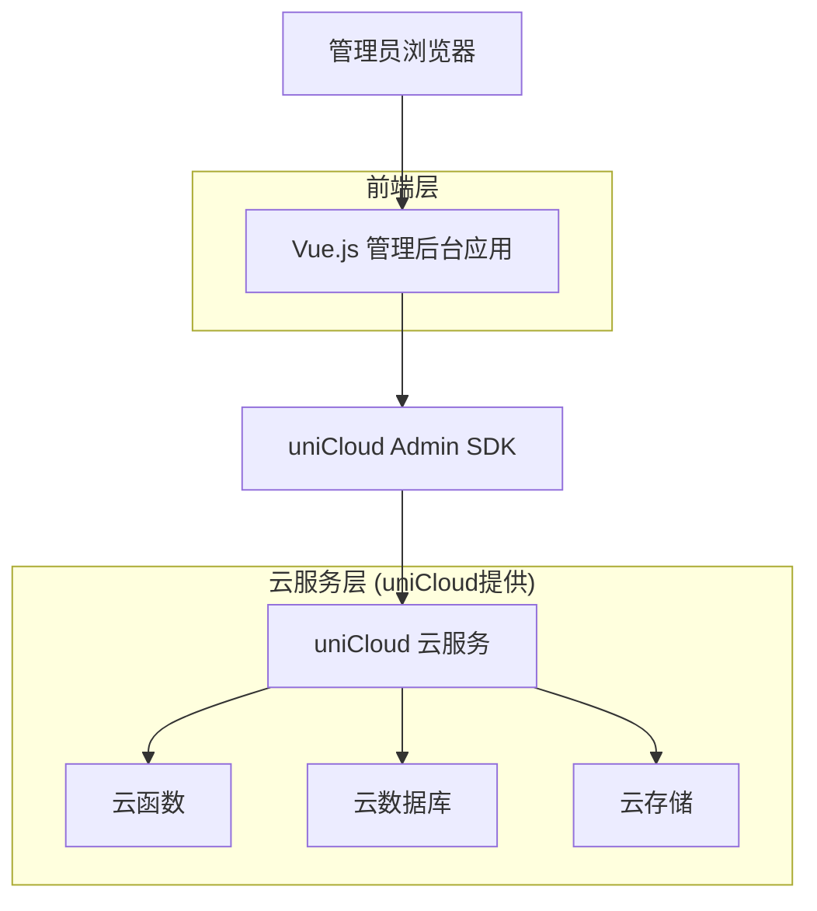
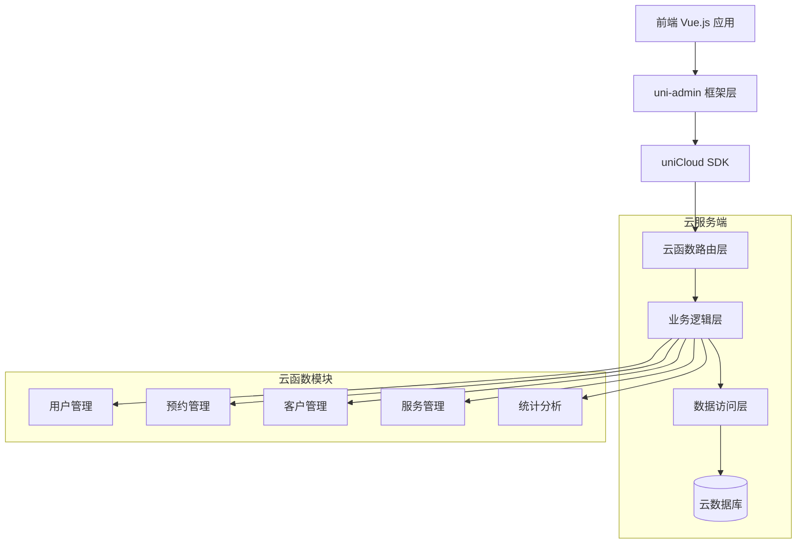
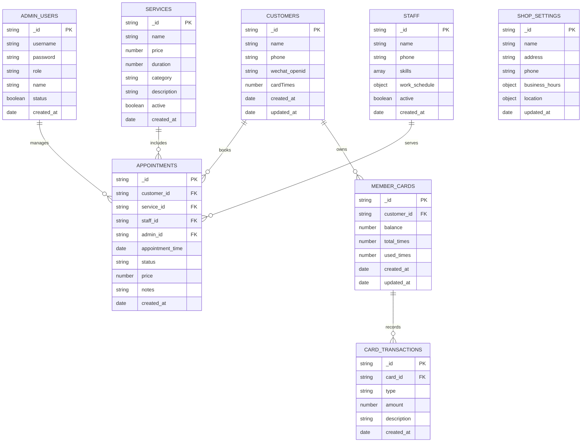

# 男士理发店管理后台技术架构文档

## 1. 架构设计



## 2. 技术描述

- **前端**: Vue.js 3 + Element Plus + uni-admin框架
- **后端**: uniCloud云服务 + 云函数
- **数据库**: uniCloud云数据库 (MongoDB)
- **存储**: uniCloud云存储
- **部署**: uniCloud一键部署

## 3. 路由定义

| 路由 | 用途 |
|------|------|
| /login | 登录页面，管理员身份验证 |
| /dashboard | 仪表盘，显示核心数据概览和今日预约 |
| /appointments | 预约管理页面，查看和处理所有预约 |
| /appointments/calendar | 预约日历视图，可视化时间安排 |
| /customers | 客户管理页面，客户信息和会员卡管理 |
| /customers/:id | 客户详情页面，查看具体客户信息 |
| /services | 服务管理页面，管理服务项目和价格 |
| /staff | 理发师管理页面，管理理发师信息和排班 |
| /shop/settings | 店铺设置页面，基本信息和营业时间配置 |
| /statistics | 数据统计页面，收入和预约数据分析 |
| /system/users | 系统用户管理，权限和角色设置 |
| /system/settings | 系统设置，参数配置和数据备份 |

## 4. API定义

### 4.1 核心API

#### 预约管理相关
```
POST /api/appointments/list
```

请求:
| 参数名称 | 参数类型 | 是否必需 | 描述 |
|----------|----------|----------|------|
| page | number | false | 页码，默认1 |
| pageSize | number | false | 每页数量，默认20 |
| status | string | false | 预约状态筛选 |
| dateRange | array | false | 时间范围筛选 |

响应:
| 参数名称 | 参数类型 | 描述 |
|----------|----------|------|
| success | boolean | 请求是否成功 |
| data | object | 预约列表数据 |
| total | number | 总记录数 |

#### 客户管理相关
```
POST /api/customers/update
```

请求:
| 参数名称 | 参数类型 | 是否必需 | 描述 |
|----------|----------|----------|------|
| customerId | string | true | 客户ID |
| name | string | false | 客户姓名 |
| phone | string | false | 手机号码 |
| cardTimes | number | false | 会员卡次数 |

响应:
| 参数名称 | 参数类型 | 描述 |
|----------|----------|------|
| success | boolean | 更新是否成功 |
| message | string | 操作结果信息 |

#### 服务管理相关
```
POST /api/services/create
```

请求:
| 参数名称 | 参数类型 | 是否必需 | 描述 |
|----------|----------|----------|------|
| name | string | true | 服务名称 |
| price | number | true | 服务价格 |
| duration | number | true | 服务时长(分钟) |
| category | string | false | 服务分类 |
| description | string | false | 服务描述 |

示例:
```json
{
  "name": "精剪造型",
  "price": 88,
  "duration": 45,
  "category": "理发",
  "description": "专业理发师精心设计造型"
}
```

## 5. 服务器架构图



## 6. 数据模型

### 6.1 数据模型定义



### 6.2 数据定义语言

#### 管理员用户表 (admin_users)
```javascript
// 创建集合
db.createCollection('admin_users')

// 创建索引
db.admin_users.createIndex({"username": 1}, {"unique": true})
db.admin_users.createIndex({"role": 1})

// 初始化数据
db.admin_users.add({
  username: 'admin',
  password: '$2a$10$encrypted_password_hash',
  role: 'super_admin',
  name: '超级管理员',
  status: true,
  created_at: new Date()
})
```

#### 客户表 (customers)
```javascript
// 创建集合
db.createCollection('customers')

// 创建索引
db.customers.createIndex({"phone": 1}, {"unique": true})
db.customers.createIndex({"wechat_openid": 1})
db.customers.createIndex({"created_at": -1})

// 初始化数据
db.customers.add({
  name: '张三',
  phone: '13800138000',
  wechat_openid: 'wx_openid_123',
  cardTimes: 5,
  created_at: new Date(),
  updated_at: new Date()
})
```

#### 预约表 (appointments)
```javascript
// 创建集合
db.createCollection('appointments')

// 创建索引
db.appointments.createIndex({"customer_id": 1})
db.appointments.createIndex({"appointment_time": 1})
db.appointments.createIndex({"status": 1})
db.appointments.createIndex({"staff_id": 1})
db.appointments.createIndex({"created_at": -1})

// 初始化数据
db.appointments.add({
  customer_id: 'customer_id_123',
  service_id: 'service_id_456',
  staff_id: 'staff_id_789',
  admin_id: 'admin_id_000',
  appointment_time: new Date('2024-01-15 14:00:00'),
  status: 'confirmed',
  price: 88,
  notes: '客户要求短发造型',
  created_at: new Date()
})
```

#### 服务表 (services)
```javascript
// 创建集合
db.createCollection('services')

// 创建索引
db.services.createIndex({"category": 1})
db.services.createIndex({"active": 1})

// 初始化数据
db.services.add([
  {
    name: '精剪造型',
    price: 88,
    duration: 45,
    category: '理发',
    description: '专业理发师精心设计造型',
    active: true,
    created_at: new Date()
  },
  {
    name: '黑人烫',
    price: 499,
    duration: 120,
    category: '烫发',
    description: '时尚黑人烫发造型',
    active: true,
    created_at: new Date()
  }
])
```

#### 理发师表 (staff)
```javascript
// 创建集合
db.createCollection('staff')

// 创建索引
db.staff.createIndex({"active": 1})

// 初始化数据
db.staff.add({
  name: '李师傅',
  phone: '13900139000',
  skills: ['理发', '烫发', '染发'],
  work_schedule: {
    monday: {start: '09:00', end: '18:00'},
    tuesday: {start: '09:00', end: '18:00'},
    wednesday: {start: '09:00', end: '18:00'},
    thursday: {start: '09:00', end: '18:00'},
    friday: {start: '09:00', end: '18:00'},
    saturday: {start: '09:00', end: '19:00'},
    sunday: {start: '10:00', end: '17:00'}
  },
  active: true,
  created_at: new Date()
})
```

#### 店铺设置表 (shop_settings)
```javascript
// 创建集合
db.createCollection('shop_settings')

// 初始化数据
db.shop_settings.add({
  name: 'M·Y 男士理发店',
  address: '北京市朝阳区某某街道123号',
  phone: '010-12345678',
  business_hours: {
    monday: {start: '09:00', end: '21:00'},
    tuesday: {start: '09:00', end: '21:00'},
    wednesday: {start: '09:00', end: '21:00'},
    thursday: {start: '09:00', end: '21:00'},
    friday: {start: '09:00', end: '21:00'},
    saturday: {start: '09:00', end: '22:00'},
    sunday: {start: '10:00', end: '20:00'}
  },
  location: {
    latitude: 39.9042,
    longitude: 116.4074
  },
  updated_at: new Date()
})
```